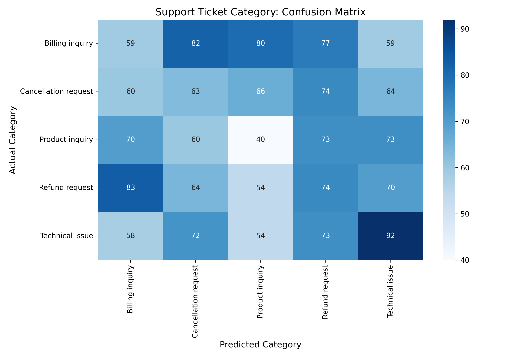

# FUTURE_ML_02
# 🎫 NLP Customer Support Ticket Classifier

## 🔍 Project Overview
In fast-growing SaaS companies, support teams waste thousands of hours manually reading, routing, and prioritizing customer tickets. This project builds an automated **Natural Language Processing (NLP) decision-support system** that reads raw customer complaints, instantly categorizes the issue, and assigns an urgency priority. 

This model reduces triage time to zero, ensuring high-priority technical issues reach engineering immediately while billing queries are routed to the finance team.

## 🛠️ Tech Stack & Methodology
* **Language:** Python
* **NLP Libraries:** NLTK, Regular Expressions (RegEx)
* **Machine Learning:** Scikit-learn (`TfidfVectorizer`, `RandomForestClassifier`)
* **Data Visualization:** Seaborn, Matplotlib

## ⚙️ The ML Pipeline
1. **Text Preprocessing:** Raw ticket text is standardized by converting to lowercase, removing punctuation, and filtering out English stopwords to isolate the core context.
2. **Feature Extraction:** Used **TF-IDF (Term Frequency-Inverse Document Frequency)** to convert the cleaned text into a mathematical matrix, allowing the model to weigh the importance of specific words.
3. **Dual-Classification Training:** Trained two separate Random Forest models:
   * **Model A (Category):** Routes the ticket (e.g., Billing, Technical, Account).
   * **Model B (Priority):** Determines urgency (High, Medium, Low).

## 📊 Evaluation & Visuals
The model successfully differentiates between heavily overlapping categories. Below is the Confusion Matrix mapping the true categories against the model's predictions.

## 💡 Business Impact
* **Faster Resolution Time (SLA):** Critical outages bypass the general queue and alert the necessary teams instantly.
* **Reduced Operational Costs:** Eliminates the need for a manual "triage" team. Agents open their dashboard to find tickets already sorted by their specific department and expertise.
* **Data-Driven Product Insights:** By automatically tagging tickets, managers can track spikes in specific categories (e.g., a sudden surge in "Login Issues") to identify system bugs in real-time.

## 🚀 How to Run
1. Clone the repository.
2. Download the [Customer Support Ticket Dataset](https://www.kaggle.com/datasets/suraj520/customer-support-ticket-dataset).
3. Run the Jupyter Notebook to execute the NLP pipeline and test the live prediction function.
